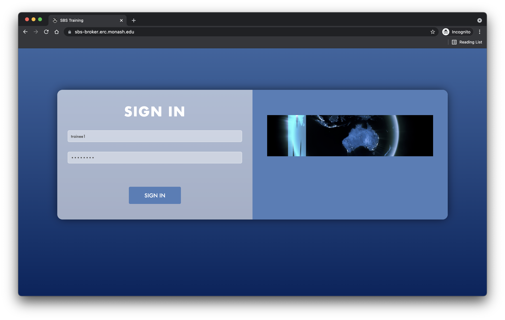
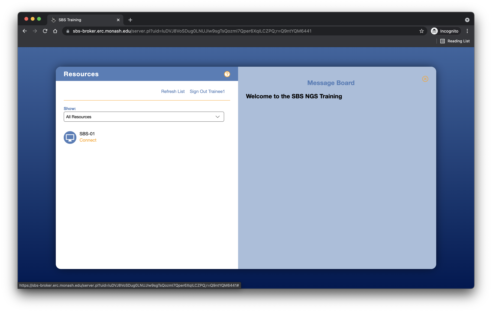
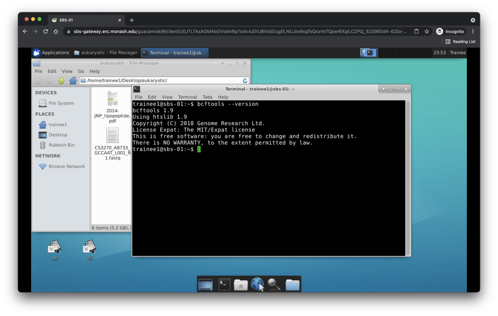

### Lecture slides
* [Slides](./Topic_1.pdf)

### Background reading
* [RADseq Andrews](./Andrews_et_al.pdf)
* [Linked read sequencing Meier](./Meier_et_al.pdf)
* [RADseq Peterson](./Peterson_et_al.pdf)
* [Sequencing review Shendure](./Shendure_Waterston_2017.pdf)

How to login to training VM 

From within Monash network access this URL:

[https://sbs-broker.erc.monash.edu/](https://sbs-broker.erc.monash.edu/)

Note that off campus you can login via a [vnp](https://www.monash.edu/esolutions/network/vpn)

Training accounts usernames and passwords will be provided.

Loading this URL in any browser will display the main/login page: 

{:width="100%"}

Login using your assigned username and password, which we will provide

Upon login to the URL/site above, the assigned instance is shown. 
{:width="100%"}

Click on the Connect link to then connect to the instance’s remote desktop (via HTML5 viewer). The instance’s desktop environment is then displayed.

Training modules (e.g qc, cli) contain datasets required for each module.

Terminal/shell is available from the bottom tools bar:

{:width="100%"}

RStudio and firefox is also installed

Monash has a number of computational resources available for research. Information about these resources can be found [here](https://www.monash.edu/researchinfrastructure/eresearch/capabilities/compute)

